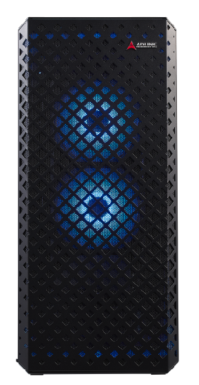
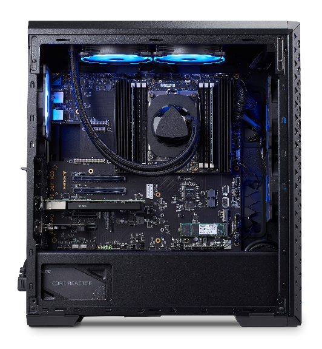
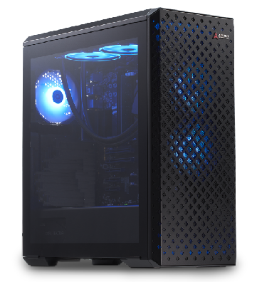
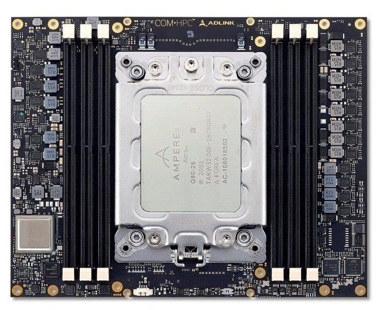
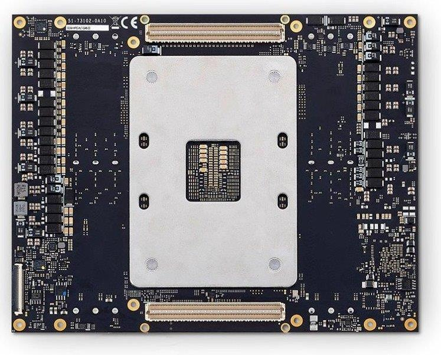
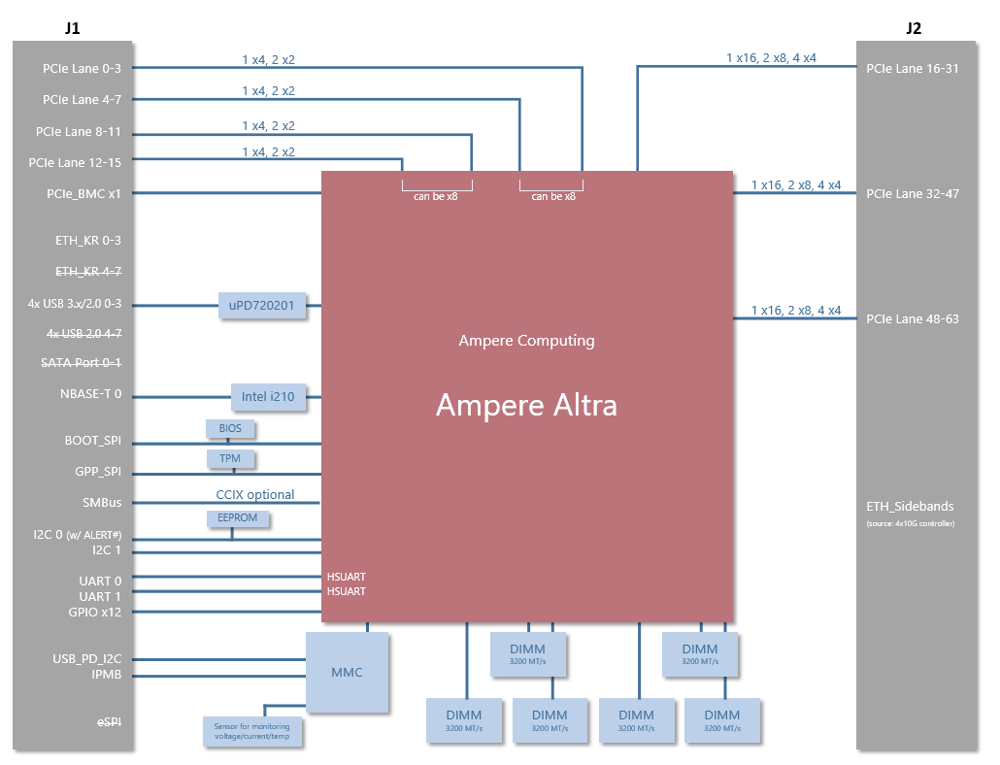
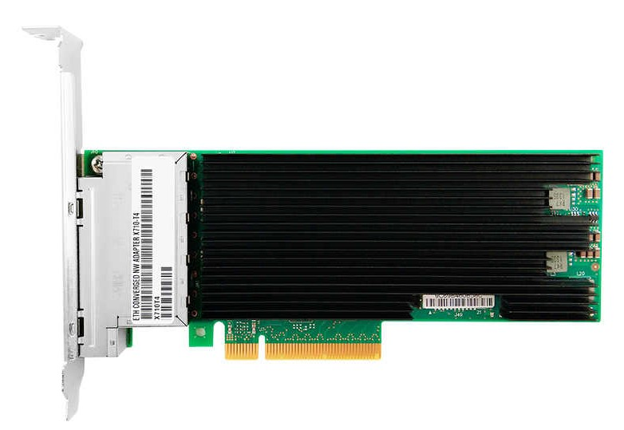
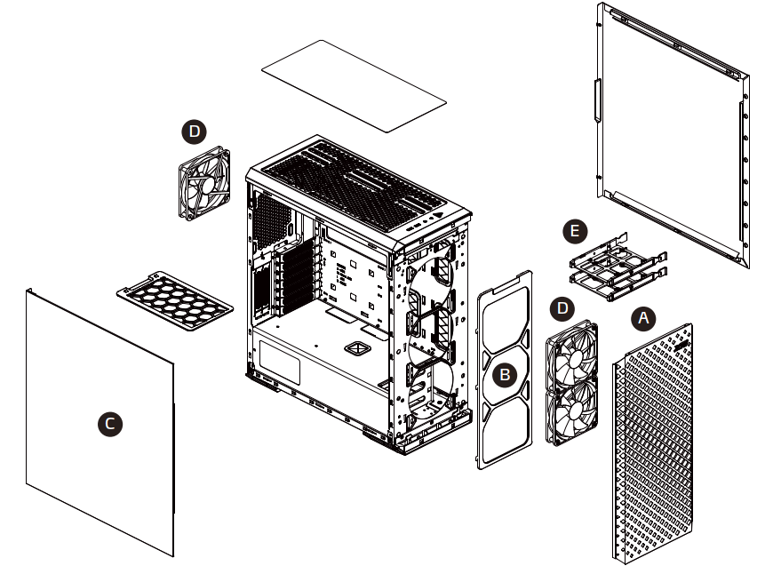
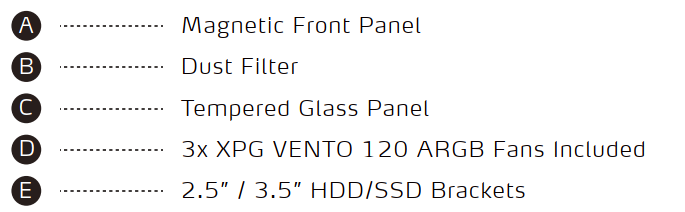

# SCDP :  ARM based Scalable Compute Development Platform

# A1 System

               

## System Components

- COM HPC module with 32-core ARM based Ampere Altra SOC
- COM HPC Server carrier
- Intel Quad 10GBe Lan Card
- USB 3.0 Card for Front panel
- System Memory
- NVMe M.2 storage 
- Tower Enclosure
- Liquid cooling assembly
- 750 Watt Power Supply

### COM HPC ALT module

#### Introduction

COM HPC ALT is a Computer on Module based on the PICMG COM HPC Server type open standard, it measures 200mm x 160mm. 
On the back side it has two 400 pin high-performance connectors, for a total  of 800 pins interconnects with a carrier board. 

The COM-HPC Server Type targets use in high-end headless (no display) embedded servers that require intensive CPU capability, large memory  capacity, and lots of high bandwidth I/O including multiple 10Gbps or  25Gbps Ethernet, and up to 65 PICe lanes, at up to PCIe Gen 5 speeds. Typical uses are in embedded server equipment ruggedized for use in field environments and applications such as autonomous vehicles, cell  tower base stations, geophysical field equipment, medical equipment,  defense systems, and much more. 

Server Modules use fixed voltage 12V input power. Server Modules can accept up to 358W of input power (using the connector vendor recommended 20% current capacity derating) over the 28 Module VCC pins, at the low end of the 12V power in range. This allows CPUs with up to about 175W dissipation to be deployed on Server Modules. The limit is subject to considerations such as the connector pin derating used, the number of memory sockets used, and other power consumers on the Module.

The COM HPC ALT module is a commercial of the shelve type of component (COTS) that can be paired with custom designed carrier to facilitate different industrial verticals.COM HPC ALT is revision controlled and offers production lifetimes in excess of 10 years.  Computer on module design are widely accepted in the embedded world and drastically lower a customer's time to market and total cost of ownership (TCO)

More information about the COM HPC formfactors can be found here : 

https://www.picmg.org/openstandards/com-hpc/

COM HPC ALT front side

COM HPC ALT back side

#### A1 Function Diagram

#### Ampere Altra SOC

### COM HPC Server Carrier

COM HPC Server carrier is a general purpose carrier for generic COM HPC server type modules typically used for prototyping purposes. 

The carrier an EATX size and can be mounted into standard EATX capable tower enclosures.

It is powered by off the shelve ATX type power supplies 

#### Function Diagram

#### Interfaces

| PCIe slots                 | Rear I/O                               | Aux Headers         |
| -------------------------- | -------------------------------------- | ------------------- |
| PCIe x16 GEN4  two slots   | 4x USB 4.0 on rear I/O                 | RS232               |
| PCIe x8 GEN4 one slot      | LAN GbE on rear I/O                    | 5x FAN power        |
| PCIe x4 GEN4 two slots     | LAN GbE on rear I/O for BMC management | Front panel signals |
| M.2 PCIe x4 GEN4 two slots | Analog VGA on rear I/O                 | SPI, GPIO, I2C      |
|                            | RS232 DB9 on rear I/O                  |                     |

### Quad 10GBASE-T LAN card

  

- Intel Ethernet Controller XL710
- 4x 10GBase-T RJ45
- Standard Cat6a Cabling with RJ45 Connectors up to 100 meters
- Autonegotiation between 100Mb/s, 1GbE and 10GbE
- PCIe 3.0 x8

### Tower Enclosure

 

### Liquid Cooling

|                                                              |                                                              |
| ------------------------------------------------------------ | ------------------------------------------------------------ |
| Asetek  based all-in-one closed loop, maintenance free liquid cooling solution  All aluminum radiator with 11 water channels to disperse water and heat.  Thermally optimized cooling plate and low-noise pump design for high performance, quiet cooling  Two 120 mm ARGB fans |  |

